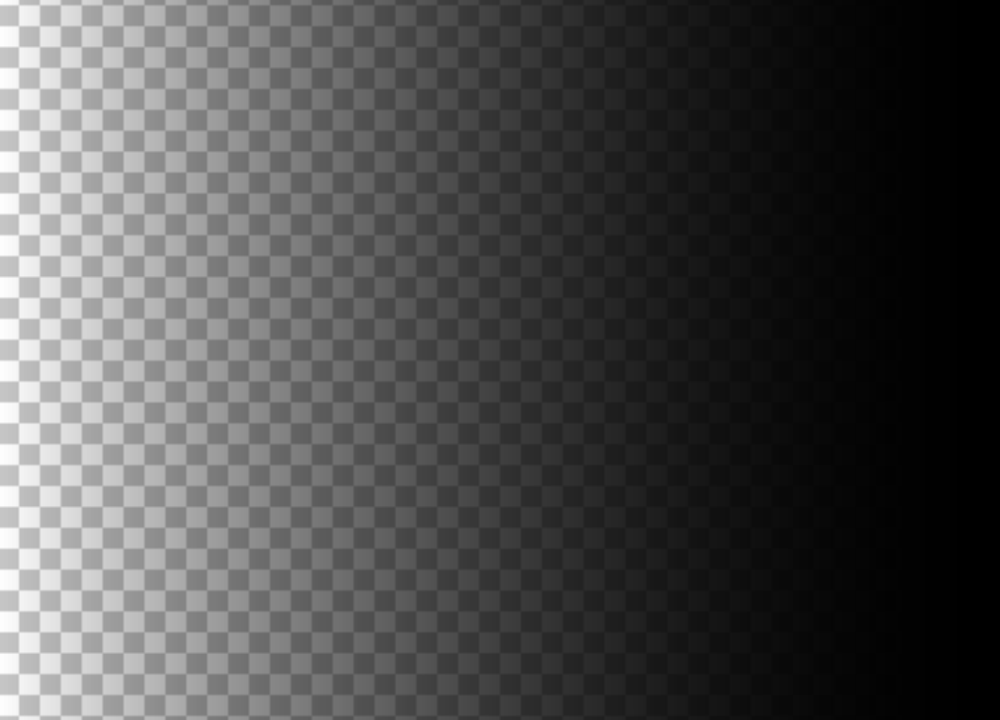

# 📚 Transparent gradient

[Official](https://transparent-gradient.netlify.app/eng.html) 
- https://transparent-gradient.netlify.app/eng.html




Hello, families of developers~ This is a real transparent gradient, not a fake transparent one. I hope it will be helpful for your front desk development.

```
npm i transparent-gradient
```

```
tGradient(target, direction)
```
First, you have to be the target for the gradient.
The second is the direction.('right', 'bottom', 'top', 'left')
**You need to apply 'position: absolute' to the target.(asterisks)**
This is an example of use.

```
import tGradient from "transparent-gradient";

//target
const content = document.querySelector('.target')
tGradient(content)
```

- example url - [https://codesandbox.io/s/transparent-gradient-profile-dmj28y]

| func | Direction    | desc    |
| :---:   | :---: | :---: |
| tGradient(target, 'right') | right   | tGradient(target, 'right') creates a gradient from right to left.  |
| tGradient(target, 'left') | left  | tGradient(target, 'left') creates a gradient from left to right.  |
| tGradient(target, 'top') | top  | tGradient(target, 'top') creates a gradient from top to bottom.  |
| tGradient(target, 'bottom') | bottom  | tGradient(target, 'bottom') creates a gradient from bottom to top.  |


2023.03.13/transparent-gradient/mr.chu
